# GeoTwin — Hierarchical Restoration Command Network
## Final-Approach Workflow and Backend Integration Blueprint

> **Version:** 3.0 — Backend and AI Reset  
> **Product:** GeoTwin  
> **Initial operating region:** Telangana  
> **Document purpose:** Canonical implementation reference for the frontend, backend, database and AI-integration teams  
> **Status:** Treat as the final implementation baseline. Future changes must be made as explicit versioned amendments.

---

# 0. Executive Decision

GeoTwin is being rebuilt around a smaller and safer architecture.

The earlier design depended on a fine-tuned model, RAG, VLM analysis and a multi-stage AI pipeline. That architecture is now removed.

The new system will use:

1. A normal deterministic backend for every official workflow.
2. A replaceable pre-trained agentic model for tool-assisted actions.
3. A separate API-based chatbot for questions, explanations and summaries.
4. Human approval for all official decisions.
5. Satellite and environmental data through independent data-provider adapters.

The backend must continue working even when both AI services are disabled.

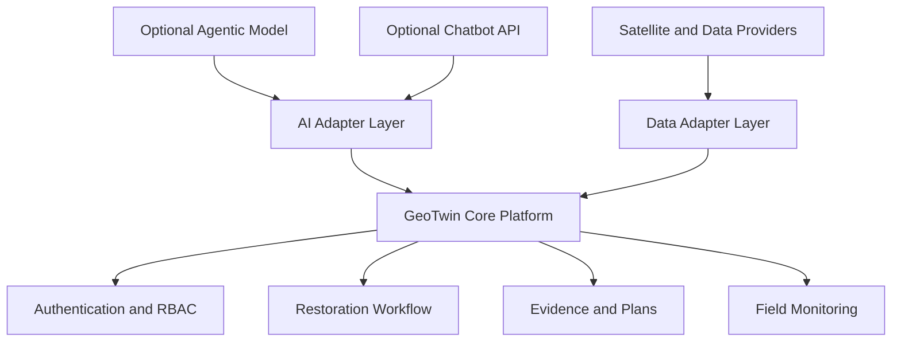
```mermaid
flowchart TD
    A["GeoTwin Core Platform"] --> B["Authentication and RBAC"]
    A --> C["Restoration Workflow"]
    A --> D["Evidence and Plans"]
    A --> E["Field Monitoring"]

    F["Optional Agentic Model"] --> G["AI Adapter Layer"]
    H["Optional Chatbot API"] --> G
    G --> A

    I["Satellite and Data Providers"] --> J["Data Adapter Layer"]
    J --> A
```

## Final architectural principle

> **GeoTwin is an evidence-driven government restoration workflow with optional AI assistance—not an LLM application that happens to contain restoration features.**

---

# 1. Product Definition

GeoTwin is a state-oriented restoration decision-support platform that converts environmental signals into:

1. Prioritised restoration cases.
2. Targeted field-verification missions.
3. Technical assessments.
4. Comparable restoration plans.
5. Human-authorised implementation.
6. Field verification.
7. Long-term outcome monitoring.

Its core innovation is the movement of evidence through a compressed government decision hierarchy.

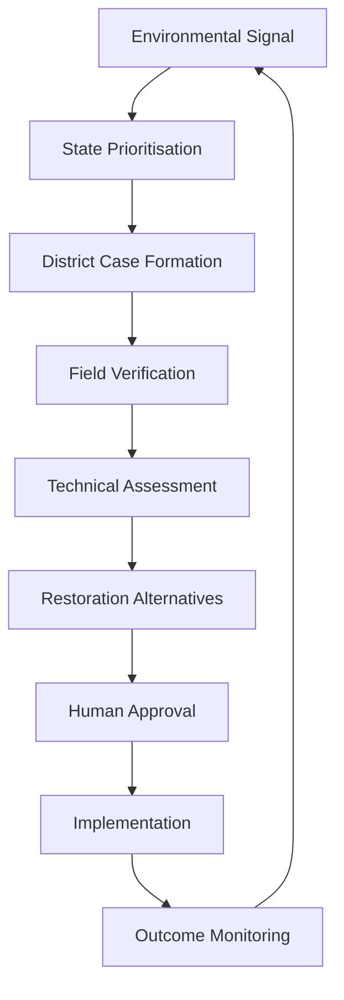
```mermaid
flowchart TD
    A["Environmental Signal"] --> B["State Prioritisation"]
    B --> C["District Case Formation"]
    C --> D["Field Verification"]
    D --> E["Technical Assessment"]
    E --> F["Restoration Alternatives"]
    F --> G["Human Approval"]
    G --> H["Implementation"]
    H --> I["Outcome Monitoring"]
    I --> A
```

## GeoTwin is not

- A complete government ERP.
- A replacement for government officers.
- A chatbot that automatically approves land-restoration work.
- A scientific laboratory.
- A system that treats an LLM answer as verified evidence.
- A full GIS suite.

## GeoTwin is

- A workflow and decision-support system.
- A traceable evidence ledger.
- A restoration-plan comparison platform.
- A field-to-command feedback loop.
- A human-controlled agentic workspace.
- A modular frontend and backend that can accept different AI providers later.

---

# 2. Government-Oriented Design Basis

GeoTwin uses a compressed role model inspired by the operating structure used in Indian watershed programmes.

WDC-PMKSY 2.0 uses state-level agencies, district-level support structures, Project Implementing Agencies and multidisciplinary Watershed Development Teams. The guidelines describe the technical team as covering agriculture, forestry, soil health, water management and community mobilisation.

GeoTwin does not claim that its role titles are statutory government designations. They are hackathon-friendly functional mappings.

Official references:

- [WDC-PMKSY 2.0 Guidelines](https://wdcpmksy.dolr.gov.in/reference/WDCPMKSY2.0_Guidelines.pdf)
- [Department of Land Resources — WDC-PMKSY](https://dolr.gov.in/en/wdcpmksy/)
- [WDC-PMKSY User Manual](https://wdcpmksy.dolr.gov.in/reference/UserManual.pdf)

## Compressed mapping

| Real-world governance idea | GeoTwin functional role |
|---|---|
| State-level nodal/programme oversight | State Programme Officer |
| District/project control and implementing coordination | District Restoration Officer |
| Multidisciplinary technical team | Technical Restoration Officer |
| Ground verification and implementation reporting | Field Verification Officer |
| Platform administration | System Administrator |

This gives GeoTwin government-oriented accountability without creating ten dashboards.

---

# 3. Final Human Officer Hierarchy

GeoTwin will have five human account roles.

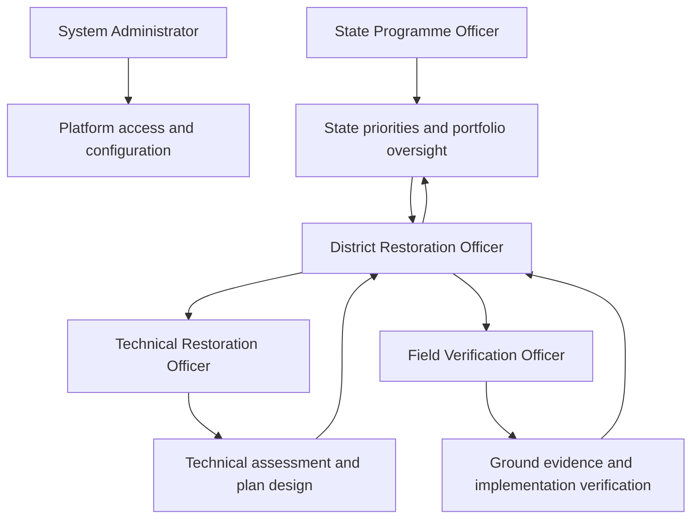
```mermaid
flowchart TD
    A["System Administrator"] --> B["Platform access and configuration"]

    C["State Programme Officer"] --> D["State priorities and portfolio oversight"]
    D --> E["District Restoration Officer"]
    E --> F["Technical Restoration Officer"]
    E --> G["Field Verification Officer"]

    F --> H["Technical assessment and plan design"]
    G --> I["Ground evidence and implementation verification"]

    H --> E
    I --> E
    E --> D
```

## Final role list

1. **System Administrator**
2. **State Programme Officer**
3. **District Restoration Officer**
4. **Technical Restoration Officer**
5. **Field Verification Officer**

## Why this hierarchy is better

- It preserves state, district, technical and field responsibility.
- It removes six separate specialist accounts.
- It creates a clear chain of command.
- It limits permission complexity.
- It gives every visible dashboard a distinct purpose.
- It supports the Evidence Escalation concept.
- It remains realistic enough for a government-oriented pitch.

## Non-human system layers

The following are platform capabilities, not officer accounts:

- Regional Intelligence Layer.
- Priority Scoring Engine.
- Evidence Validation Engine.
- Decision Gate Engine.
- Notification Engine.
- Agentic AI Adapter.
- Chat Assistant Adapter.
- Satellite and Environmental Data Adapter.

---

# 4. Authority Model

## Core rule

> The State Programme Officer prioritises. The District Restoration Officer owns the case. The Technical Restoration Officer assesses and designs. The Field Verification Officer captures reality. The Administrator manages the platform.

## Permission matrix

| Capability | Administrator | State Officer | District Officer | Technical Officer | Field Officer |
|---|---:|---:|---:|---:|---:|
| Manage accounts and roles | Yes | No | No | No | No |
| Configure catalogues and data sources | Yes | View | View | View | No |
| View statewide map and portfolio | System view | Yes | Assigned districts | Assigned cases | Assigned missions |
| Accept or dismiss priority signal | No | Yes | Recommend | No | No |
| Select exact restoration land patch | No | View | Yes | Recommend change | Verify |
| Create restoration case | No | Authorise | Yes | No | No |
| Assign Technical Officer | No | View | Yes | No | No |
| Assign Field Officer | No | View | Yes | No | No |
| Submit field evidence | No | View | View | View | Yes |
| Submit technical assessment | No | View | View/comment | Yes | No |
| Request additional evidence | No | Yes | Yes | Yes | Respond |
| Generate plan alternatives | No | View | Start/review | Draft | No |
| Approve restoration plan | No | Escalation view | Yes | No | No |
| Submit implementation progress | No | View | Monitor | Review | Yes |
| Accept implementation completion | No | View | Yes | Recommend | No |
| Close restoration case | No | Portfolio view | Yes | Recommend | No |
| View audit logs | System-wide | Portfolio | Assigned cases | Own cases | Own missions |

## Separation-of-duty rules

1. An officer cannot approve their own technical assessment.
2. The Technical Officer cannot approve a restoration plan.
3. The Field Officer cannot approve their own completion report.
4. The Administrator cannot make restoration decisions.
5. AI services cannot approve, close or delete official records.
6. Approved plan versions cannot be edited.
7. A changed plan must become a new version.

---

# 5. Role 1 — System Administrator

## Purpose

The Administrator manages the platform rather than restoration projects.

## Administrator page features

### Overview

- Active users.
- Role distribution.
- API health.
- Failed background jobs.
- Storage usage.
- Recent security events.
- External data-provider status.

### User and role management

- Create officer account.
- Assign role.
- Assign state, district or project scope.
- Activate or deactivate account.
- Reset access.
- View last login.

### Configuration

- Intervention catalogue.
- Evidence-type catalogue.
- Telangana district configuration.
- Priority-score thresholds.
- Decision-gate requirements.
- Feature flags.
- AI provider settings without displaying secret keys.

### Audit and health

- View system audit events.
- View failed integrations.
- Retry safe background jobs.
- View application version.

## Administrator workflow

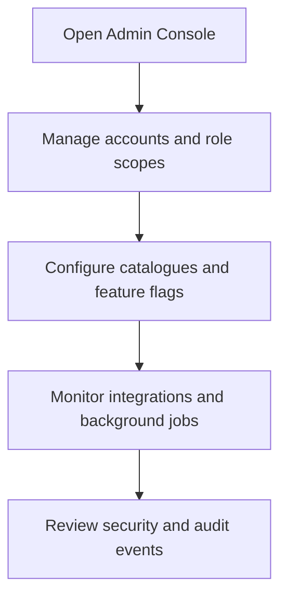
```mermaid
flowchart TD
    A["Open Admin Console"] --> B["Manage accounts and role scopes"]
    B --> C["Configure catalogues and feature flags"]
    C --> D["Monitor integrations and background jobs"]
    D --> E["Review security and audit events"]
```

## Administrator restrictions

- Cannot create a restoration decision.
- Cannot approve a plan.
- Cannot alter officer-authored evidence.
- Cannot silently remove an audit event.

---

# 6. Role 2 — State Programme Officer

## Purpose

The State Programme Officer oversees Telangana-level priorities and programme progress.

This officer does not manually manage every field task. They decide where state attention should be directed.

## State Officer page features

### State Command Centre

- Telangana priority map.
- District-level summary.
- New priority signals.
- Active restoration cases.
- Area under restoration.
- Evidence-debt distribution.
- Plans awaiting escalation.
- Outcome-monitoring status.

### Priority Signal Queue

For each signal:

- Location.
- Priority score.
- Score breakdown.
- Available data.
- Missing evidence.
- Reason for signal.
- Recommended district.
- Accept, dismiss or request screening.

### Portfolio oversight

- Case progress by district.
- Overdue cases.
- High-risk plans.
- Implementation performance.
- Outcome monitoring.
- Reports.

## State Officer decisions

The State Officer may:

- Accept a priority signal.
- Dismiss a false or irrelevant signal with a reason.
- Request more screening information.
- Assign the accepted signal to a District Restoration Officer.
- Escalate a state-level policy concern.
- View, but not rewrite, district decisions.

## State Officer workflow

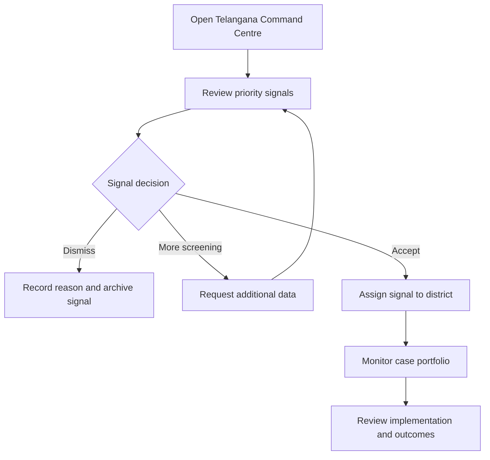
```mermaid
flowchart TD
    A["Open Telangana Command Centre"] --> B["Review priority signals"]
    B --> C{"Signal decision"}
    C -- Dismiss --> D["Record reason and archive signal"]
    C -- More screening --> E["Request additional data"]
    E --> B
    C -- Accept --> F["Assign signal to district"]
    F --> G["Monitor case portfolio"]
    G --> H["Review implementation and outcomes"]
```

---

# 7. Role 3 — District Restoration Officer

## Purpose

The District Restoration Officer is the primary case owner and project decision-maker.

This officer selects the exact land patch within an accepted priority zone, creates the case, assigns work, reviews evidence, compares plans and approves implementation.

## District Officer page features

### District dashboard

- Assigned priority signals.
- Active cases.
- Cases waiting for field evidence.
- Cases waiting for technical review.
- Plans waiting for approval.
- Implementation alerts.
- Overdue missions.

### Land Selection Workspace

- District/mandal/village navigation.
- Accepted priority zone.
- Satellite base layer.
- Land-boundary selection.
- Area summary.
- Available NDVI/environmental indicators.
- Existing restoration-case warning.
- Save as draft land patch.

### Case 360

- Case status.
- Land patch.
- Evidence Ledger.
- Evidence Debt.
- Field missions.
- Technical assessment.
- Restoration plans.
- Decision gates.
- Implementation timeline.
- Audit timeline.

### Decision Workspace

- Compare No-Action, Plan A and Plan B.
- Review benefits, risks, cost category and duration.
- Review evidence links.
- Review unresolved gaps.
- Request changes.
- Approve plan.
- Record justification.

## District Officer workflow

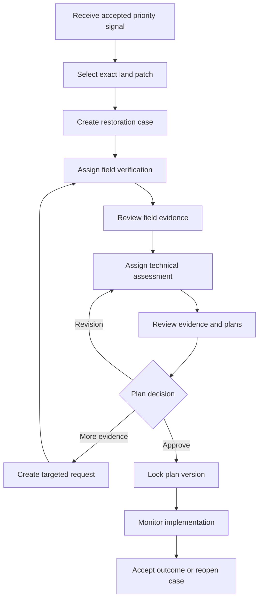
```mermaid
flowchart TD
    A["Receive accepted priority signal"] --> B["Select exact land patch"]
    B --> C["Create restoration case"]
    C --> D["Assign field verification"]
    D --> E["Review field evidence"]
    E --> F["Assign technical assessment"]
    F --> G["Review evidence and plans"]
    G --> H{"Plan decision"}
    H -- More evidence --> I["Create targeted request"]
    I --> D
    H -- Revision --> F
    H -- Approve --> J["Lock plan version"]
    J --> K["Monitor implementation"]
    K --> L["Accept outcome or reopen case"]
```

## District Officer restrictions

- Cannot overwrite submitted evidence.
- Cannot edit the Technical Officer’s signed assessment.
- Cannot change an approved plan without creating a new version.
- Cannot close a case while blocking monitoring issues remain.

---

# 8. Role 4 — Technical Restoration Officer

## Purpose

The Technical Restoration Officer represents a compressed multidisciplinary restoration team.

Instead of creating separate Soil, Water, Forestry, Agriculture, Environment and Community accounts, one technical workspace contains six structured review modules.

## Technical modules

1. Soil and erosion.
2. Water and watershed.
3. Vegetation and biodiversity.
4. Agriculture and land productivity.
5. Environmental safeguards.
6. Community and maintenance feasibility.

The Technical Officer may complete all modules in the hackathon demo. In a future production version, individual modules can be assigned to different specialists without changing the main case workflow.

## Technical Officer page features

### Assignment queue

- New technical reviews.
- Evidence requested.
- Assessments returned for revision.
- Field-change reassessments.

### Technical Workspace

- Land and satellite context.
- Field evidence.
- Six technical modules.
- Evidence-gap creation.
- Intervention catalogue.
- Constraints.
- Dependencies.
- Monitoring indicators.
- Plan alternative builder.
- Assessment version history.

## Required assessment structure

Every module records:

1. Baseline condition.
2. Main problem.
3. Severity.
4. Supporting evidence.
5. Recommended intervention.
6. Intervention to avoid.
7. Risk.
8. Dependency.
9. Assumption.
10. Monitoring indicator.

## Technical Officer workflow

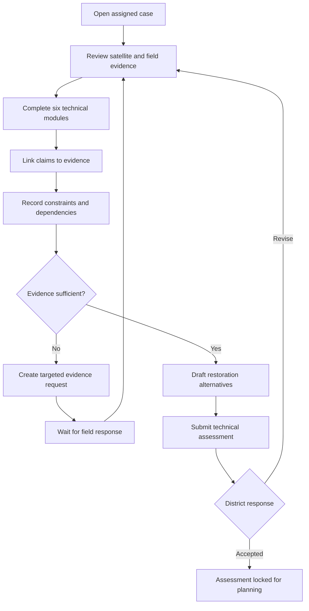
```mermaid
flowchart TD
    A["Open assigned case"] --> B["Review satellite and field evidence"]
    B --> C["Complete six technical modules"]
    C --> D["Link claims to evidence"]
    D --> E["Record constraints and dependencies"]
    E --> F{"Evidence sufficient?"}
    F -- No --> G["Create targeted evidence request"]
    G --> H["Wait for field response"]
    H --> B
    F -- Yes --> I["Draft restoration alternatives"]
    I --> J["Submit technical assessment"]
    J --> K{"District response"}
    K -- Revise --> B
    K -- Accepted --> L["Assessment locked for planning"]
```

## Technical Officer restrictions

- Cannot fabricate missing measurements.
- Cannot mark community agreement as confirmed without evidence.
- Cannot approve a plan.
- Cannot modify field evidence.
- Cannot declare ecological recovery based only on implementation completion.

---

# 9. Role 5 — Field Verification Officer

## Purpose

The Field Verification Officer captures ground truth before, during and after restoration.

The Field Officer receives targeted missions. They do not upload random evidence without a case requirement.

## Field Officer page features

### My Missions

- New missions.
- Due today.
- Overdue missions.
- Draft observations.
- Submitted missions.
- Implementation visits.
- Monitoring visits.

### Mission detail

- What must be verified.
- Where the land is located.
- Why the evidence is required.
- Required checklist.
- Previous evidence.
- Map and navigation reference.
- Due date.

### Field capture

- Structured observation form.
- Photo upload.
- Notes.
- Optional coordinates.
- Observation date.
- Evidence-quality declaration.
- Save offline draft.
- Submit when online.

### Implementation monitoring

- Approved activity.
- Expected milestone.
- Planned versus observed progress.
- Deviation category.
- Change alert.

## Field Officer workflow

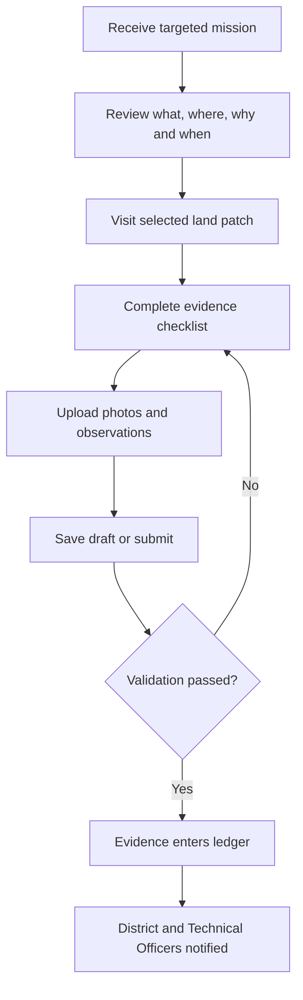
```mermaid
flowchart TD
    A["Receive targeted mission"] --> B["Review what, where, why and when"]
    B --> C["Visit selected land patch"]
    C --> D["Complete evidence checklist"]
    D --> E["Upload photos and observations"]
    E --> F["Save draft or submit"]
    F --> G{"Validation passed?"}
    G -- No --> D
    G -- Yes --> H["Evidence enters ledger"]
    H --> I["District and Technical Officers notified"]
```

## Field Officer restrictions

- Cannot select the final plan.
- Cannot approve their own evidence.
- Cannot change the selected land boundary.
- Cannot close a restoration case.
- Cannot modify an approved milestone.

---

# 10. Complete Officer Collaboration Workflow

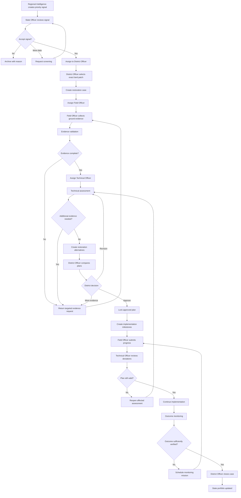
```mermaid
flowchart TD
    A["Regional Intelligence creates priority signal"] --> B["State Officer reviews signal"]
    B --> C{"Accept signal?"}
    C -- No --> D["Archive with reason"]
    C -- More data --> E["Request screening"]
    E --> B
    C -- Yes --> F["Assign to District Officer"]

    F --> G["District Officer selects exact land patch"]
    G --> H["Create restoration case"]
    H --> I["Assign Field Officer"]

    I --> J["Field Officer collects ground evidence"]
    J --> K["Evidence validation"]
    K --> L{"Evidence complete?"}
    L -- No --> M["Return targeted evidence request"]
    M --> J

    L -- Yes --> N["Assign Technical Officer"]
    N --> O["Technical assessment"]
    O --> P{"Additional evidence needed?"}
    P -- Yes --> M
    P -- No --> Q["Create restoration alternatives"]

    Q --> R["District Officer compares plans"]
    R --> S{"District decision"}
    S -- Revision --> O
    S -- More evidence --> M
    S -- Approve --> T["Lock approved plan"]

    T --> U["Create implementation milestones"]
    U --> V["Field Officer submits progress"]
    V --> W["Technical Officer reviews deviations"]
    W --> X{"Plan still valid?"}
    X -- No --> Y["Reopen affected assessment"]
    Y --> O
    X -- Yes --> Z["Continue implementation"]

    Z --> AA["Outcome monitoring"]
    AA --> AB{"Outcome sufficiently verified?"}
    AB -- No --> AC["Schedule monitoring mission"]
    AC --> V
    AB -- Yes --> AD["District Officer closes case"]
    AD --> AE["State portfolio updated"]
```

---

# 11. Exact Case Lifecycle

The frontend must never directly choose an arbitrary case status.

Only the backend Workflow Service may perform transitions.

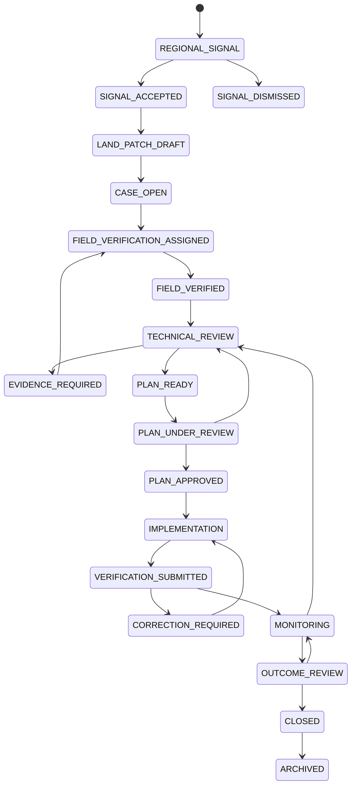
```mermaid
stateDiagram-v2
    [*] --> REGIONAL_SIGNAL
    REGIONAL_SIGNAL --> SIGNAL_ACCEPTED
    REGIONAL_SIGNAL --> SIGNAL_DISMISSED
    SIGNAL_ACCEPTED --> LAND_PATCH_DRAFT
    LAND_PATCH_DRAFT --> CASE_OPEN
    CASE_OPEN --> FIELD_VERIFICATION_ASSIGNED
    FIELD_VERIFICATION_ASSIGNED --> FIELD_VERIFIED
    FIELD_VERIFIED --> TECHNICAL_REVIEW
    TECHNICAL_REVIEW --> EVIDENCE_REQUIRED
    EVIDENCE_REQUIRED --> FIELD_VERIFICATION_ASSIGNED
    TECHNICAL_REVIEW --> PLAN_READY
    PLAN_READY --> PLAN_UNDER_REVIEW
    PLAN_UNDER_REVIEW --> TECHNICAL_REVIEW
    PLAN_UNDER_REVIEW --> PLAN_APPROVED
    PLAN_APPROVED --> IMPLEMENTATION
    IMPLEMENTATION --> VERIFICATION_SUBMITTED
    VERIFICATION_SUBMITTED --> CORRECTION_REQUIRED
    CORRECTION_REQUIRED --> IMPLEMENTATION
    VERIFICATION_SUBMITTED --> MONITORING
    MONITORING --> TECHNICAL_REVIEW
    MONITORING --> OUTCOME_REVIEW
    OUTCOME_REVIEW --> MONITORING
    OUTCOME_REVIEW --> CLOSED
    CLOSED --> ARCHIVED
```

## State ownership

| State | Primary owner |
|---|---|
| `REGIONAL_SIGNAL` | System / State Officer |
| `SIGNAL_ACCEPTED` | State Officer |
| `LAND_PATCH_DRAFT` | District Officer |
| `CASE_OPEN` | District Officer |
| `FIELD_VERIFICATION_ASSIGNED` | Field Officer |
| `FIELD_VERIFIED` | District Officer |
| `TECHNICAL_REVIEW` | Technical Officer |
| `EVIDENCE_REQUIRED` | Field Officer |
| `PLAN_READY` | Technical Officer |
| `PLAN_UNDER_REVIEW` | District Officer |
| `PLAN_APPROVED` | District Officer |
| `IMPLEMENTATION` | Field Officer / District Officer |
| `VERIFICATION_SUBMITTED` | District Officer |
| `CORRECTION_REQUIRED` | Field Officer |
| `MONITORING` | Field + Technical Officers |
| `OUTCOME_REVIEW` | District Officer |
| `CLOSED` | District Officer |
| `ARCHIVED` | System |

## Transition requirements

Every transition must contain:

- Current state.
- Requested next state.
- Acting user.
- Permission check.
- Validation result.
- Decision-gate result.
- Reason or comment where required.
- Timestamp.
- Audit event.

---

# 12. Evidence Escalation Ladder

Evidence moves upward through the hierarchy.

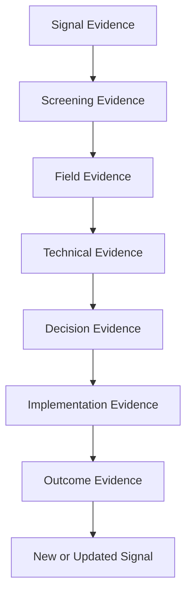
```mermaid
flowchart TD
    A["Signal Evidence"] --> B["Screening Evidence"]
    B --> C["Field Evidence"]
    C --> D["Technical Evidence"]
    D --> E["Decision Evidence"]
    E --> F["Implementation Evidence"]
    F --> G["Outcome Evidence"]
    G --> H["New or Updated Signal"]
```

## Evidence stages

### Stage 1 — Signal

- Environmental indicator suggests possible priority.
- No project exists yet.
- No human decision has been made.

### Stage 2 — Screened

- Land boundary and available indicators are usable.
- State Officer decides whether the signal deserves district attention.

### Stage 3 — Field verified

- Field Officer responds to a targeted mission.
- Ground evidence is added to the case.

### Stage 4 — Technical review

- Technical Officer evaluates the six technical modules.
- Gaps, constraints and dependencies are identified.

### Stage 5 — Decision ready

- Plans are comparable.
- Blocking issues are visible.
- District Officer makes the plan decision.

### Stage 6 — Implementation verified

- Planned work is compared with reported work.
- Deviations are recorded.

### Stage 7 — Outcome monitored

- Implementation completion is separated from ecological outcome.
- Monitoring may reopen technical review.

---

# 13. Evidence Ledger

Every case has an append-only Evidence Ledger.

## Evidence categories

- Satellite observation.
- Environmental indicator.
- Land boundary.
- Field photograph.
- Field observation.
- Community consultation note.
- Technical assessment.
- Evidence-gap request.
- Plan alternative.
- Approval event.
- Implementation observation.
- Monitoring observation.

## Every evidence item contains

- Evidence ID.
- Case ID.
- Evidence type.
- Source.
- Source date.
- Submitted by.
- Submission date.
- Related claim.
- Verification status.
- File or data reference.
- Version.
- Notes.

## Evidence statuses

- `SUBMITTED`
- `VALIDATED`
- `NEEDS_CLARIFICATION`
- `SUPERSEDED`
- `REJECTED`

Evidence is never physically overwritten. Corrections create a new version and mark the previous version as superseded.

---

# 14. Evidence Debt

Evidence Debt represents the amount of decision-critical information that remains missing.

It is not an AI confidence score.

## Evidence Debt levels

| Level | Meaning |
|---|---|
| Low | All required evidence exists; only optional information is missing |
| Moderate | Important evidence is missing but a human may continue with recorded justification |
| High | One or more decision-critical gaps remain |
| Blocking | A required decision gate cannot pass |

## Evidence Debt calculation

Evidence Debt should be generated by deterministic rules:

- Required evidence missing.
- Evidence older than configured threshold.
- Conflicting evidence.
- Unverified field observation.
- Missing technical module.
- Missing environmental safeguard.
- Missing community-maintenance responsibility.

The LLM may explain Evidence Debt but cannot calculate or change it independently.

---

# 15. Decision Gates

Every important state transition passes through a backend-controlled decision gate.

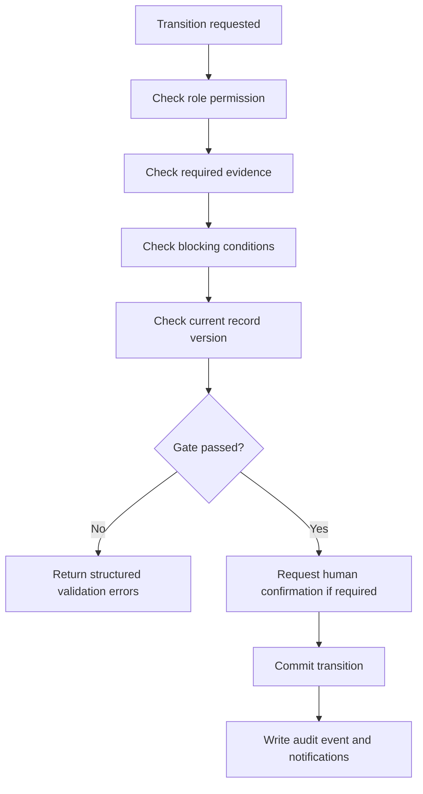
```mermaid
flowchart TD
    A["Transition requested"] --> B["Check role permission"]
    B --> C["Check required evidence"]
    C --> D["Check blocking conditions"]
    D --> E["Check current record version"]
    E --> F{"Gate passed?"}
    F -- No --> G["Return structured validation errors"]
    F -- Yes --> H["Request human confirmation if required"]
    H --> I["Commit transition"]
    I --> J["Write audit event and notifications"]
```

## Required gates

| Gate | Human owner | Purpose |
|---|---|---|
| Signal Acceptance | State Officer | Confirm that the priority deserves district attention |
| Case Opening | District Officer | Confirm the exact land patch and project objective |
| Field Verification | District Officer | Confirm sufficient ground evidence |
| Technical Readiness | Technical Officer | Confirm assessment completeness |
| Plan Authorisation | District Officer | Select and approve a plan |
| Implementation Acceptance | District Officer | Accept completed work or request correction |
| Outcome Closure | District Officer | Confirm sufficient outcome evidence |

---

# 16. Land Selection Responsibility

The District Restoration Officer selects the exact land patch.

The Regional Intelligence Layer identifies a broader priority zone. The State Officer accepts that priority. The District Officer then selects the project boundary because district-level project control requires local operational context.

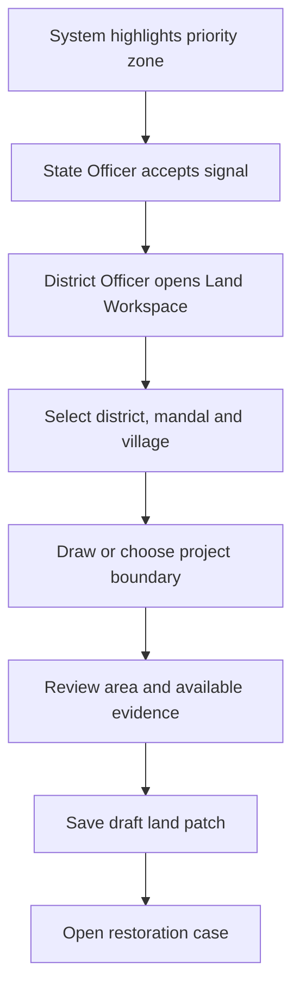
```mermaid
flowchart TD
    A["System highlights priority zone"] --> B["State Officer accepts signal"]
    B --> C["District Officer opens Land Workspace"]
    C --> D["Select district, mandal and village"]
    D --> E["Draw or choose project boundary"]
    E --> F["Review area and available evidence"]
    F --> G["Save draft land patch"]
    G --> H["Open restoration case"]
```

## Hackathon GIS rules

- Store the selected boundary as GeoJSON.
- Do not require PostGIS.
- Use a map provider only for visualisation.
- Use backend data adapters for satellite and environmental results.
- Store the provider, source date and retrieval date.
- Cache results by polygon hash and data date.
- Do not calculate statewide data on every map click.
- Precompute reliable demo regions.

---

# 17. Restoration Plan Workflow

Three comparable outputs should be shown:

1. No-Action Baseline.
2. Plan A — Lower intervention or lower cost.
3. Plan B — More comprehensive resilience plan.

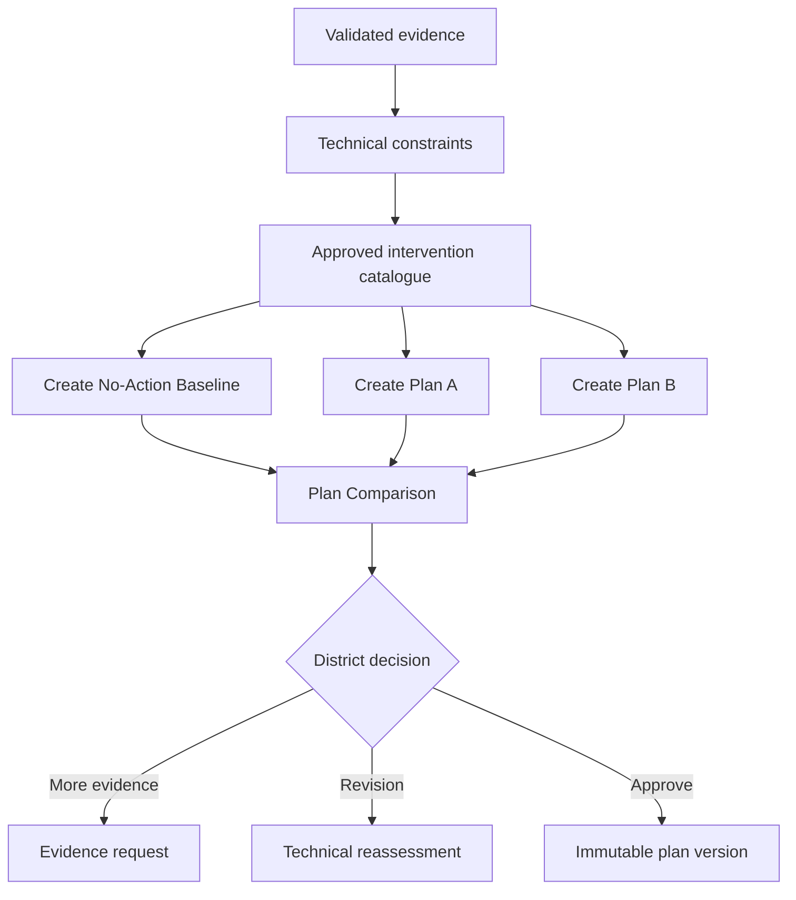
```mermaid
flowchart TD
    A["Validated evidence"] --> B["Technical constraints"]
    B --> C["Approved intervention catalogue"]
    C --> D["Create No-Action Baseline"]
    C --> E["Create Plan A"]
    C --> F["Create Plan B"]
    D --> G["Plan Comparison"]
    E --> G
    F --> G
    G --> H{"District decision"}
    H -- More evidence --> I["Evidence request"]
    H -- Revision --> J["Technical reassessment"]
    H -- Approve --> K["Immutable plan version"]
```

## Every plan contains

- Plan ID.
- Case ID.
- Version.
- Objective.
- Activities.
- Responsible role.
- Cost category.
- Duration.
- Sequence.
- Expected benefit.
- Risks.
- Assumptions.
- Evidence links.
- Environmental safeguards.
- Community-maintenance responsibility.
- Monitoring indicators.
- Status.

## Plan version rules

- Draft plans may be edited.
- Submitted plans become review versions.
- Approved plans are immutable.
- Any change creates a new version.
- Only one plan version may be active.
- Previous approvals remain in the audit timeline.

---

# 18. Implementation and Monitoring

## Implementation workflow

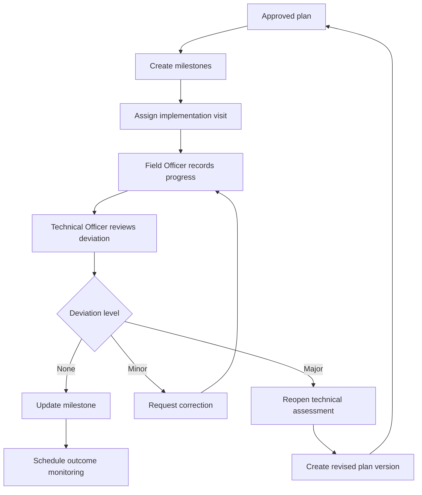
```mermaid
flowchart TD
    A["Approved plan"] --> B["Create milestones"]
    B --> C["Assign implementation visit"]
    C --> D["Field Officer records progress"]
    D --> E["Technical Officer reviews deviation"]
    E --> F{"Deviation level"}
    F -- None --> G["Update milestone"]
    F -- Minor --> H["Request correction"]
    H --> D
    F -- Major --> I["Reopen technical assessment"]
    I --> J["Create revised plan version"]
    J --> A
    G --> K["Schedule outcome monitoring"]
```

## Monitoring principle

> Completed work does not automatically mean successful restoration.

GeoTwin keeps separate statuses for:

- Work completed.
- Implementation accepted.
- Monitoring active.
- Outcome sufficiently verified.

## Monitoring indicators may include

- Vegetation trend.
- Visible erosion condition.
- Water-retention observation.
- Survival of planted vegetation.
- Condition of restoration structures.
- Agricultural or land-use effect.
- Community-maintenance activity.

---

# 19. New AI Architecture

The previous AI pipeline is removed.

## Explicitly removed

- Fine-tuned project-specific LLM dependency.
- RAG pipeline.
- Vector database requirement.
- VLM image-analysis pipeline.
- Model-generated GIS values.
- AI-controlled approval.
- AI as a required part of state transitions.

## New AI services

GeoTwin supports two separate and optional AI integrations:

1. **Agentic Assistant**
2. **Chat Assistant**

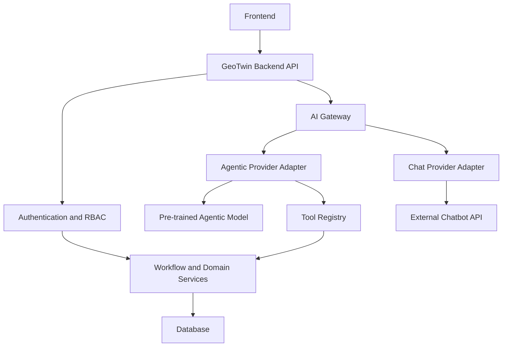
```mermaid
flowchart TD
    A["Frontend"] --> B["GeoTwin Backend API"]
    B --> C["Authentication and RBAC"]
    C --> D["Workflow and Domain Services"]

    B --> E["AI Gateway"]
    E --> F["Agentic Provider Adapter"]
    E --> G["Chat Provider Adapter"]

    F --> H["Pre-trained Agentic Model"]
    G --> I["External Chatbot API"]

    F --> J["Tool Registry"]
    J --> D

    D --> K["Database"]
```

## Non-negotiable AI rule

> AI providers never connect directly to the database and never receive unrestricted backend access.

---

# 20. Agentic Assistant

## Purpose

The Agentic Assistant helps officers navigate the platform, retrieve permitted information, draft records and propose actions.

It uses a pre-trained model capable of structured tool calling.

It does not need project-specific fine-tuning.

## Agent action classes

### Read actions

- Find assigned cases.
- Open a case summary.
- List evidence gaps.
- Compare plans.
- Show overdue missions.
- Retrieve monitoring status.

### Navigation actions

- Open a permitted page.
- Focus a case.
- Select a dashboard filter.
- Open an evidence item.

### Draft actions

- Draft a field mission.
- Draft an evidence request.
- Draft a technical summary.
- Draft a plan explanation.
- Draft a report.

### Proposed write actions

- Propose creating a mission.
- Propose requesting evidence.
- Propose submitting a draft.
- Propose recording a comment.

Proposed write actions require:

1. Backend permission validation.
2. Schema validation.
3. A user-visible preview.
4. Explicit human confirmation.
5. Audit logging.

## Agent action flow

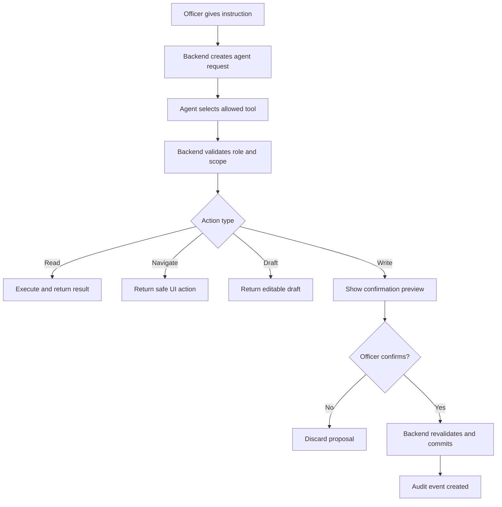
```mermaid
flowchart TD
    A["Officer gives instruction"] --> B["Backend creates agent request"]
    B --> C["Agent selects allowed tool"]
    C --> D["Backend validates role and scope"]
    D --> E{"Action type"}
    E -- Read --> F["Execute and return result"]
    E -- Navigate --> G["Return safe UI action"]
    E -- Draft --> H["Return editable draft"]
    E -- Write --> I["Show confirmation preview"]
    I --> J{"Officer confirms?"}
    J -- No --> K["Discard proposal"]
    J -- Yes --> L["Backend revalidates and commits"]
    L --> M["Audit event created"]
```

## The agent cannot

- Approve a plan.
- Close a case.
- Delete evidence.
- Change an officer’s role.
- Modify an approved plan.
- Bypass a decision gate.
- Execute a write without confirmation.
- Access a case outside the user’s scope.

---

# 21. Chat Assistant

## Purpose

The Chat Assistant is a normal API-based chatbot used for:

- Explaining page fields.
- Answering questions about the current case.
- Summarising visible evidence.
- Explaining plan differences.
- Drafting officer notes.
- Explaining workflow stages.

## Chat Assistant restrictions

- Read-only by default.
- No direct site control.
- No database access.
- No direct plan approval.
- No secret exposure.
- No unrestricted project-history injection.

## Chat context

The backend builds a bounded context package containing only:

- Current user role.
- Current page.
- Current case summary.
- Permitted evidence summaries.
- Current workflow status.
- Selected plan summaries.

The frontend must never send the entire database or API secrets to the model.

## Provider independence

The chatbot must be accessed through a backend interface so the provider can be changed without modifying frontend pages.

API keys must:

- Stay in backend environment variables or a secret manager.
- Never be included in frontend source code.
- Never be returned in an API response.
- Be separated by development, test and production environments.

---

# 22. AI Gateway Contract

The backend exposes one AI Gateway with two internal provider contracts:

## Agent provider responsibilities

- Receive structured conversation input.
- Receive permitted tool definitions.
- Return a structured tool request or assistant response.
- Support cancellation and timeout.
- Return provider-neutral errors.

## Chat provider responsibilities

- Receive bounded chat context.
- Return text or streamed text.
- Support cancellation and timeout.
- Return provider-neutral errors.

## Required fallback behaviour

If an AI provider is unavailable:

- Core workflows remain available.
- Forms remain manually usable.
- Plans can be created from templates and structured data.
- The UI displays a non-blocking AI-unavailable message.
- No case status is changed.

---

# 23. Backend Architecture

GeoTwin should use a modular monolith for the hackathon.

Do not use microservices.

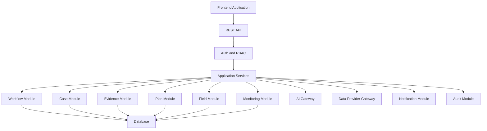
```mermaid
flowchart TD
    A["Frontend Application"] --> B["REST API"]
    B --> C["Auth and RBAC"]
    C --> D["Application Services"]

    D --> E["Workflow Module"]
    D --> F["Case Module"]
    D --> G["Evidence Module"]
    D --> H["Plan Module"]
    D --> I["Field Module"]
    D --> J["Monitoring Module"]

    D --> K["AI Gateway"]
    D --> L["Data Provider Gateway"]
    D --> M["Notification Module"]
    D --> N["Audit Module"]

    E --> O["Database"]
    F --> O
    G --> O
    H --> O
    I --> O
    J --> O
```

## Recommended backend modules

### Auth Module

- Login/session verification.
- Role checks.
- District/case scope checks.

### User Module

- Officer profiles.
- Assignments.
- Account status.

### Region and Signal Module

- Telangana hierarchy.
- Priority signals.
- Score breakdown.
- Signal decisions.

### Land Module

- GeoJSON boundary.
- Area.
- Location hierarchy.
- Cached data summaries.

### Case Module

- Case creation.
- Assignment.
- Case 360 aggregation.

### Workflow Module

- State machine.
- Transition validation.
- Decision gates.

### Mission Module

- Field missions.
- Evidence checklists.
- Due dates.

### Evidence Module

- Evidence Ledger.
- Files.
- Versions.
- Evidence Debt.

### Technical Assessment Module

- Six technical modules.
- Constraints.
- Dependencies.
- Evidence gaps.

### Plan Module

- Baseline.
- Plan alternatives.
- Versioning.
- Approval.

### Implementation Module

- Activities.
- Milestones.
- Progress.
- Deviations.

### Monitoring Module

- Monitoring visits.
- Outcome indicators.
- Reopening.
- Closure.

### AI Gateway Module

- Agent provider.
- Chat provider.
- Tool registry.
- Confirmation proposals.

### Data Provider Module

- Satellite provider.
- Environmental indicator provider.
- Mock/precomputed provider.
- Provider cache.

### Audit Module

- Append-only business events.
- Security-sensitive actions.

### Notification Module

- Assignment.
- Evidence request.
- Revision.
- Approval.
- Field alert.

### Report Module

- Case report.
- Plan approval report.
- Implementation report.
- Monitoring report.

---

# 24. Core Data Records

| Record | Purpose |
|---|---|
| User | Account identity |
| OfficerProfile | Role, department and scope |
| Region | State, district, mandal and village |
| PrioritySignal | Potential restoration priority |
| SignalDecision | State Officer decision |
| LandPatch | Selected GeoJSON boundary |
| RestorationCase | Main case record |
| CaseAssignment | Connects officers to case responsibilities |
| FieldMission | Targeted ground-verification task |
| MissionChecklistItem | Required field action |
| EvidenceItem | Evidence Ledger entry |
| EvidenceVersion | Correction or superseding version |
| EvidenceClaim | Links a claim to evidence |
| EvidenceGap | Missing required information |
| TechnicalAssessment | Versioned six-module assessment |
| TechnicalConstraint | Restriction or dependency |
| PlanVersion | Restoration alternative or approved plan |
| PlanActivity | Planned intervention |
| DecisionGate | Readiness and blocking conditions |
| DecisionEvent | Human decision and justification |
| Milestone | Implementation target |
| FieldObservation | Progress or monitoring observation |
| ChangeAlert | Major deviation or changed condition |
| MonitoringEvent | Outcome monitoring record |
| Notification | Officer task or update |
| AuditEvent | Permanent action history |
| BackgroundJob | Long-running external process |
| DataCache | Cached satellite/environmental result |
| AISession | Agent or chatbot session |
| AIActionProposal | Pending confirmed agent action |

---

# 25. Frontend–Backend Contract

The frontend should be replaceable without changing business rules.

## Backend owns

- Authentication.
- Authorisation.
- Current case state.
- Allowed transitions.
- Decision gates.
- Evidence Debt.
- Plan versioning.
- Approval logic.
- Audit records.
- AI tool permissions.

## Frontend owns

- Presentation.
- Routing.
- Form experience.
- Animations.
- Loading states.
- Local draft state.
- Accessibility.
- Responsive layout.

## Frontend must not

- Decide whether a transition is valid.
- Calculate official priority or Evidence Debt.
- Directly call the AI provider.
- Directly call satellite providers.
- Store API secrets.
- Edit approved plan objects.
- Assume a role based only on a route name.

## Integration rule

Use documented request and response contracts. Generate or maintain a shared API schema so prompt-generated frontend code can connect without knowing backend internals.

---

# 26. Recommended API Groups

All routes should be versioned under `/api/v1`.

## Authentication

- `/auth/login`
- `/auth/logout`
- `/auth/me`
- `/auth/refresh`

## Users and roles

- `/users`
- `/officers`
- `/assignments`

## Regions and signals

- `/regions`
- `/signals`
- `/signals/{signalId}`
- `/signals/{signalId}/decision`

## Land and cases

- `/land-patches`
- `/cases`
- `/cases/{caseId}`
- `/cases/{caseId}/summary`
- `/cases/{caseId}/transition`

## Missions and evidence

- `/missions`
- `/missions/{missionId}`
- `/missions/{missionId}/submit`
- `/cases/{caseId}/evidence`
- `/cases/{caseId}/evidence-debt`

## Technical review

- `/cases/{caseId}/technical-assessment`
- `/cases/{caseId}/evidence-gaps`
- `/cases/{caseId}/constraints`

## Plans and decisions

- `/cases/{caseId}/plans`
- `/plans/{planId}`
- `/plans/{planId}/submit`
- `/plans/{planId}/approve`
- `/cases/{caseId}/decision-gates`

## Implementation and monitoring

- `/cases/{caseId}/milestones`
- `/milestones/{milestoneId}/observations`
- `/cases/{caseId}/change-alerts`
- `/cases/{caseId}/monitoring`
- `/cases/{caseId}/close`

## AI

- `/ai/agent/messages`
- `/ai/agent/proposals/{proposalId}/confirm`
- `/ai/agent/proposals/{proposalId}/reject`
- `/ai/chat/messages`

## Jobs and reports

- `/jobs/{jobId}`
- `/cases/{caseId}/reports`
- `/portfolio/reports`

---

# 27. API Behaviour Standards

## Every API response should provide

- Data.
- Request ID.
- Timestamp.
- Optional warnings.

## Every error should provide

- Stable error code.
- User-safe message.
- Field errors where relevant.
- Request ID.

## Important errors

- `UNAUTHENTICATED`
- `FORBIDDEN`
- `OUT_OF_SCOPE`
- `INVALID_TRANSITION`
- `GATE_BLOCKED`
- `VALIDATION_FAILED`
- `VERSION_CONFLICT`
- `EXTERNAL_PROVIDER_UNAVAILABLE`
- `AI_PROVIDER_UNAVAILABLE`
- `RATE_LIMITED`

## Concurrency

Use record-version checks for:

- Assessments.
- Plans.
- Missions.
- Case transitions.

If two officers edit the same version, the backend returns `VERSION_CONFLICT` instead of overwriting one officer’s work.

---

# 28. Role-Based Routing

## Shared routes

- `/login`
- `/dashboard`
- `/notifications`
- `/profile`
- `/help`

## Administrator routes

- `/admin`
- `/admin/users`
- `/admin/configuration`
- `/admin/integrations`
- `/admin/audit`

## State Officer routes

- `/command`
- `/command/map`
- `/command/signals`
- `/command/portfolio`
- `/command/reports`

## District Officer routes

- `/district`
- `/district/signals`
- `/district/land-workspace`
- `/cases/{caseId}`
- `/cases/{caseId}/decision`
- `/cases/{caseId}/implementation`

## Technical Officer routes

- `/technical`
- `/technical/assignments`
- `/cases/{caseId}/technical`
- `/cases/{caseId}/plans`

## Field Officer routes

- `/field`
- `/field/missions`
- `/field/missions/{missionId}`
- `/field/history`

The backend remains the final authority even if a user manually enters another role’s URL.

---

# 29. Notifications

GeoTwin requires in-app notifications for:

- New signal assignment.
- New field mission.
- Technical assessment assignment.
- Missing evidence request.
- Mission returned for correction.
- Technical revision request.
- Plan awaiting approval.
- Plan approved.
- Milestone due.
- Major field deviation.
- Monitoring mission due.
- Case reopened.

Notifications must link to the relevant record and be marked read independently.

For the hackathon, in-app notifications are enough. Email and SMS are future extensions.

---

# 30. Audit Architecture

Audit events must be append-only.

## Audit events include

- Login and security-sensitive actions.
- Signal acceptance or dismissal.
- Land-patch creation.
- Officer assignment.
- Evidence submission or superseding correction.
- Assessment submission.
- Evidence-gap creation.
- Plan submission.
- Plan approval.
- State transition.
- Milestone acceptance.
- Case reopening.
- Case closure.
- Confirmed AI write proposal.

## Audit event fields

- Event ID.
- Actor ID.
- Actor role.
- Action.
- Target type.
- Target ID.
- Case ID.
- Timestamp.
- Before/after version reference.
- Request ID.
- Human justification where required.

---

# 31. Performance and Lag-Free Architecture

## Frontend performance

- Lazy-load role-specific routes.
- Load the map only on map pages.
- Load map layers only when enabled.
- Use thumbnail images in lists.
- Compress uploads before transfer where quality remains acceptable.
- Paginate cases, missions and audit history.
- Debounce map selections and search.
- Virtualise very long tables.
- Use skeleton loaders instead of blocking screens.
- Avoid heavy background videos inside authenticated workspaces.
- Respect reduced-motion preferences.
- Keep decorative animation separate from data rendering.

## Backend performance

- Use a modular monolith.
- Add database indexes for status, role, district, case ID and due date.
- Use pagination.
- Cache region boundaries and external environmental results.
- Use short external-provider timeouts.
- Add retry only for safe idempotent operations.
- Avoid external API calls inside database transactions.
- Precompute portfolio metrics where useful.
- Use background jobs for slow satellite or report tasks.

## AI performance

- Never place AI in the critical save/approve path.
- Stream chatbot responses.
- Limit context to the current case and permission scope.
- Set provider timeout and cancellation.
- Cache safe read-only summaries.
- Keep the manual workflow available.

## Map performance

- Start at district/priority-zone resolution.
- Do not load every Telangana feature at full detail.
- Simplify GeoJSON for display.
- Fetch detailed geometry only after selection.
- Cache selected demo locations.

---

# 32. Background Jobs

Use asynchronous jobs only for operations that may take noticeable time:

- Satellite data retrieval.
- Environmental analysis retrieval.
- Large report generation.
- Optional AI plan explanation.
- Portfolio recalculation.

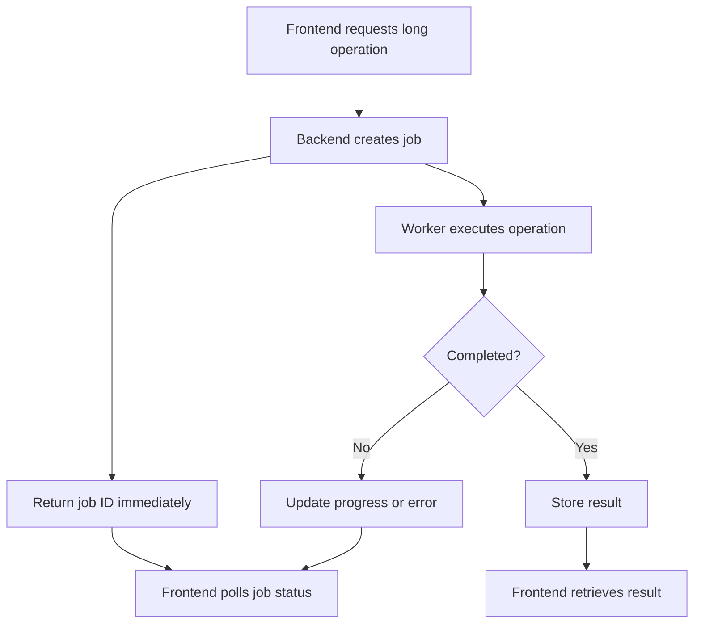
```mermaid
flowchart TD
    A["Frontend requests long operation"] --> B["Backend creates job"]
    B --> C["Return job ID immediately"]
    C --> D["Frontend polls job status"]
    B --> E["Worker executes operation"]
    E --> F{"Completed?"}
    F -- No --> G["Update progress or error"]
    G --> D
    F -- Yes --> H["Store result"]
    H --> I["Frontend retrieves result"]
```

For the hackathon, REST polling is safer than introducing a complex realtime system.

---

# 33. Configuration and Environment

Use separate configuration for:

- Local development.
- Test.
- Demo/staging.
- Production.

## Configuration categories

- Database URL.
- Authentication secrets.
- Allowed frontend origins.
- File-storage settings.
- Satellite-provider credentials.
- Agentic-model provider settings.
- Chatbot API credentials.
- Provider timeouts.
- Upload limits.
- Feature flags.
- Logging level.

## Feature flags

Recommended flags:

- `AGENTIC_ASSISTANT_ENABLED`
- `CHAT_ASSISTANT_ENABLED`
- `LIVE_SATELLITE_ENABLED`
- `PRECOMPUTED_DEMO_DATA_ENABLED`
- `OFFLINE_FIELD_DRAFTS_ENABLED`
- `OUTCOME_MONITORING_ENABLED`

No secret should be committed to Git or exposed through frontend environment variables.

---

# 34. Deployment-Ready Shape

GeoTwin can be deployed as:

1. Static frontend hosting.
2. One backend application.
3. One relational database.
4. Object storage for evidence files.
5. Optional background worker.
6. Optional AI providers.

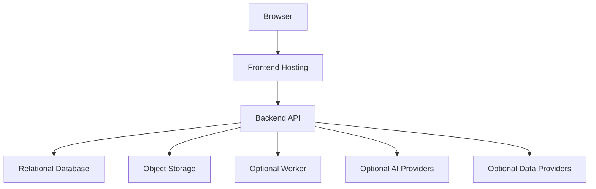
```mermaid
flowchart TD
    A["Browser"] --> B["Frontend Hosting"]
    B --> C["Backend API"]
    C --> D["Relational Database"]
    C --> E["Object Storage"]
    C --> F["Optional Worker"]
    C --> G["Optional AI Providers"]
    C --> H["Optional Data Providers"]
```

The AI providers and data providers must be replaceable without redeploying or rewriting the frontend.

---

# 35. Hackathon Scope

## P0 — Must work flawlessly

- Login and role-based routing.
- Five account roles.
- Priority-signal queue.
- District land selection.
- Restoration-case creation.
- Field mission assignment.
- Structured field evidence.
- Technical six-module assessment.
- Evidence Ledger.
- Evidence Debt.
- No-Action, Plan A and Plan B.
- District plan approval.
- Immutable plan version.
- Implementation milestone.
- Field progress observation.
- Case timeline and report.
- Mock/precomputed data fallback.
- AI adapter interfaces even if a provider is temporarily disabled.

## P1 — Strong differentiators

- Live satellite image or NDVI integration.
- Agentic navigation and read tools.
- Confirmed agent write proposals.
- API-based contextual chatbot.
- Before/after imagery.
- Outcome-monitoring loop.
- State portfolio visualisations.

## P2 — Stretch only

- Offline field synchronisation.
- Advanced change detection.
- Multiple state support.
- Real-time WebSockets.
- Fine-grained specialist assignment inside the technical modules.
- Email/SMS notification.
- Advanced analytics.

Do not begin P2 work until the complete P0 demo path is stable.

---

# 36. Final Demo Workflow

Use one deterministic Telangana case.

## Demo story

1. Regional Intelligence highlights a high-priority zone.
2. State Officer reviews the transparent priority breakdown.
3. State Officer accepts the signal and assigns a district.
4. District Officer selects the exact land patch.
5. District Officer creates the case and sends a targeted field mission.
6. Field Officer records erosion, water and vegetation observations.
7. Technical Officer reviews six structured restoration modules.
8. The Evidence Ledger shows what supports each claim.
9. Evidence Debt exposes one missing water confirmation.
10. A targeted second field request fills the gap.
11. Technical Officer submits No-Action, Plan A and Plan B.
12. District Officer compares and approves Plan B.
13. The approved plan becomes immutable.
14. Field Officer submits implementation progress.
15. A major deviation reopens only the affected technical review.
16. A revised plan version is approved.
17. Monitoring begins.
18. The case remains “implemented, outcome under monitoring” instead of being falsely declared successful.

This demonstrates:

- Government hierarchy.
- Human accountability.
- Evidence-driven decision-making.
- Agentic assistance.
- Field verification.
- Plan versioning.
- Long-term monitoring.

---

# 37. Acceptance Criteria

The implementation is correct only if:

1. Every user sees only their permitted scope.
2. The District Officer selects the exact land patch.
3. The State Officer accepts the broader priority signal.
4. Field evidence is linked to a targeted mission.
5. Technical claims link to evidence.
6. Evidence Debt comes from backend rules.
7. Invalid state transitions are rejected by the backend.
8. Approved plans cannot be edited.
9. Plan changes create new versions.
10. AI can be disabled without breaking the workflow.
11. The Agentic Assistant cannot write without confirmation.
12. The chatbot never receives API secrets.
13. External data failures produce safe fallbacks.
14. Frontend pages use API contracts rather than duplicating business logic.
15. Long tasks do not freeze the interface.
16. Every decision creates an audit event.
17. Implementation completion and outcome verification remain separate.

---

# 38. Non-Negotiable Development Rules

1. Build a modular monolith, not microservices.
2. Keep only five human account roles.
3. Keep specialist knowledge inside six Technical Review modules.
4. Keep business logic out of frontend components.
5. Keep AI providers behind adapters.
6. Keep satellite providers behind adapters.
7. Do not include RAG, VLM or fine-tuning dependencies.
8. Do not put API keys in the frontend.
9. Do not let AI directly access the database.
10. Do not let the frontend directly change case status.
11. Use decision gates for protected transitions.
12. Use immutable approved plan versions.
13. Use version conflicts rather than silent overwrites.
14. Keep an append-only Evidence Ledger and audit timeline.
15. Keep manual workflows available when AI is down.
16. Cache external data.
17. Precompute the hackathon demo case.
18. Keep field pages mobile-first.
19. Keep authenticated workspaces calmer and lighter than the cinematic landing page.
20. Freeze the P0 demo flow before adding stretch features.

---

# 39. Final Operational Model

```mermaid
flowchart TD
    A["Programme Objective"] --> B["Regional Priority Signal"]
    B --> C["State Officer Acceptance"]
    C --> D["District Land Selection"]
    D --> E["Targeted Field Mission"]
    E --> F["Ground Evidence"]
    F --> G["Technical Restoration Assessment"]
    G --> H["Evidence Ledger and Evidence Debt"]
    H --> I["Restoration Plan Alternatives"]
    I --> J["District Decision Gate"]
    J --> K["Versioned Approved Plan"]
    K --> L["Field Implementation"]
    L --> M["Implementation Verification"]
    M --> N["Outcome Monitoring"]
    N --> B
```

> **The intelligence layer identifies where attention may be needed. The State Officer accepts the priority. The District Officer selects the exact land and owns the case. The Field Officer captures ground reality. The Technical Officer converts evidence into restoration alternatives. The District Officer authorises the plan. GeoTwin then tracks implementation and continues monitoring outcomes.**

---

# 40. Backend Generation Instruction

When this document is supplied to a coding assistant, use the following implementation interpretation:

> Build GeoTwin as a modular, API-first restoration workflow platform. Implement the deterministic workflow, permissions, evidence rules, decision gates and plan versioning before integrating AI. Create clean REST contracts that allow a separately generated frontend to connect without importing backend business logic. Implement the Agentic Assistant and Chat Assistant through provider-neutral adapters. The Agentic Assistant may read, navigate, draft and propose actions, but all writes require backend validation and human confirmation. The Chat Assistant is read-only and receives bounded context. Do not implement RAG, VLM or model fine-tuning. Ensure the platform remains fully functional and responsive when AI or external satellite providers are unavailable.

